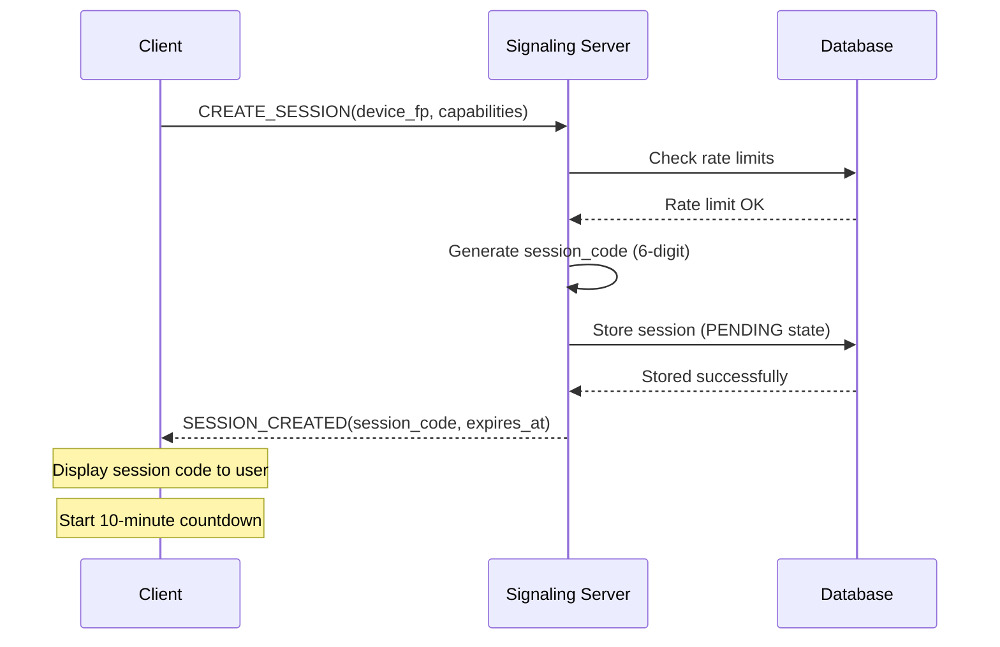
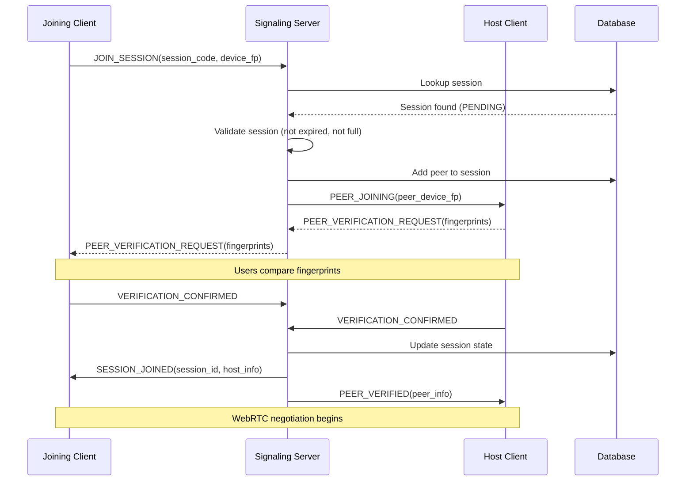
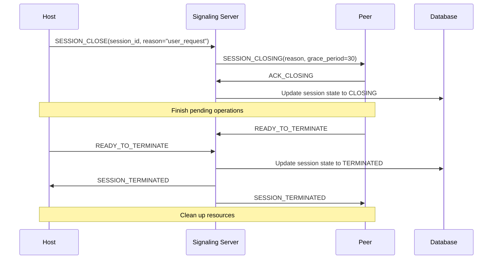

# Deliverable 4: Session Management Design

## 1. Session Lifecycle Model

### 1.1 Session States

```
CREATED → PENDING → ACTIVE → CLOSING → TERMINATED
     ↑          ↓         ↓         ↓
     └──EXPIRED─┘         │         └──ERROR
                          └──SUSPENDED
```

**State Definitions:**

1. **CREATED** (Transient):
   - Session object instantiated client-side
   - Not yet registered with server
   - Exists for milliseconds

2. **PENDING**:
   - Registered with signaling server
   - Session code generated and valid
   - Waiting for peer devices to join
   - 10-minute timeout until EXPIRED

3. **ACTIVE**:
   - At least 2 devices connected
   - WebRTC connections established
   - Data flowing between devices
   - Heartbeats maintained

4. **CLOSING**:
   - Graceful termination initiated
   - Finishing pending operations
   - Notifying peers of shutdown
   - 30-second timeout to TERMINATED

5. **TERMINATED**:
   - Session completely ended
   - Resources freed
   - Audit logs finalized
   - Final state

6. **EXPIRED**:
   - Session code timed out (10 minutes)
   - No successful connections
   - Automatically cleaned up

7. **SUSPENDED**:
   - Temporary network loss
   - Device sleep/hibernation
   - Auto-recovery attempted (within same session)
   - 5-minute timeout to TERMINATED

8. **ERROR**:
   - Unrecoverable error occurred
   - Immediate termination
   - Error logs captured

### 1.2 State Transitions

```python
STATE_TRANSITIONS = {
    'CREATED': ['PENDING', 'ERROR'],
    'PENDING': ['ACTIVE', 'EXPIRED', 'ERROR'],
    'ACTIVE': ['CLOSING', 'SUSPENDED', 'ERROR'],
    'CLOSING': ['TERMINATED', 'ERROR'],
    'SUSPENDED': ['ACTIVE', 'TERMINATED', 'ERROR'],
    'EXPIRED': ['TERMINATED'],
    'TERMINATED': [],  # Terminal state
    'ERROR': ['TERMINATED']
}
```

## 2. Session Data Model

### 2.1 Server-Side Session Representation

```python
class Session:
    def __init__(self):
        self.session_id = generate_uuid()
        self.session_code = generate_session_code()  # 6-digit
        self.created_at = current_time()
        self.expires_at = current_time() + 600  # 10 minutes
        
        # Creator information
        self.creator = {
            'device_fingerprint': 'fp_abc123...',
            'platform': 'ubuntu',
            'ip_address': '203.0.113.1',
            'user_agent': 'InputShare/1.0.0'
        }
        
        # Peer devices (max 5)
        self.peers = []  # List of Peer objects
        
        # Session configuration
        self.config = {
            'max_peers': 5,
            'allow_screen_sharing': False,
            'require_confirmations': True,
            'encryption_level': 'high'
        }
        
        # Security state
        self.security = {
            'verified_devices': set(),  # Device fingerprints
            'pending_confirmations': {},  # request_id -> data
            'rate_limits': RateLimitTracker(),
            'audit_log': AuditLog()
        }
        
        # Connection state
        self.connections = {
            'signaling': True,  # WebSocket connections
            'webrtc': {}  # peer_id -> WebRTC connection state
        }
        
        # Statistics
        self.stats = {
            'bytes_sent': 0,
            'bytes_received': 0,
            'input_events': 0,
            'start_time': None,
            'end_time': None
        }
```

### 2.2 Peer Device Representation

```python
class Peer:
    def __init__(self, device_fingerprint):
        self.peer_id = generate_uuid()
        self.device_fingerprint = device_fingerprint
        self.joined_at = current_time()
        self.last_seen = current_time()
        
        # Device information
        self.device_info = {
            'platform': 'windows',
            'version': '1.0.0',
            'name': 'Work Laptop',  # User-assigned
            'capabilities': ['keyboard', 'mouse', 'clipboard']
        }
        
        # Connection information
        self.connection = {
            'ip_address': '198.51.100.2',
            'user_agent': 'InputShare/1.0.0 (Windows)',
            'webrtc_state': 'connecting',
            'signaling_ws': 'connected'
        }
        
        # Role in session
        self.role = 'peer',  # 'host', 'peer', 'viewer'
        self.permissions = {
            'can_send_input': True,
            'can_receive_input': True,
            'can_access_clipboard': True,
            'can_request_screen': False
        }
        
        # Statistics
        self.stats = {
            'bytes_sent': 0,
            'bytes_received': 0,
            'input_events_sent': 0,
            'input_events_received': 0
        }
```

## 3. Session Establishment Flow

### 3.1 Creating a Session



**Client Actions After Creation:**
1. Display session code prominently
2. Show QR code for easy sharing
3. Start countdown timer (10 minutes)
4. Listen for peer connections
5. Prepare WebRTC infrastructure

### 3.2 Joining a Session



**Verification Process Details:**
1. Both devices display truncated fingerprints (8 chars)
2. Users compare visually or via QR scan
3. Both must explicitly confirm within 2 minutes
4. Timeout results in automatic rejection

### 3.3 WebRTC Connection Establishment

**After Verification:**
1. Host creates WebRTC offer
2. Exchange SDP via signaling server
3. Exchange ICE candidates
4. Establish DataChannels
5. Perform key exchange over secure channel
6. Begin heartbeats

**Connection States per Peer:**
- `disconnected`: No connection attempt
- `connecting`: WebRTC negotiation in progress
- `connected`: DataChannels established
- `degraded`: Partial connectivity (some channels failed)
- `disconnecting`: Graceful shutdown
- `failed`: Unrecoverable error

## 4. Session Maintenance

### 4.1 Heartbeat Mechanism

**Client → Server (every 30 seconds):**
```json
{
  "type": "heartbeat",
  "session_id": "sess_abc123",
  "peer_id": "peer_123",
  "timestamp": 1678901234567,
  "stats": {
    "webrtc_state": "connected",
    "channels": {"control": "open", "input": "open"},
    "queued_messages": 0
  }
}
```

**Server Response:**
```json
{
  "type": "heartbeat_ack",
  "session_id": "sess_abc123",
  "timestamp": 1678901234567,
  "server_time": 1678901235000,
  "peer_status": [
    {"peer_id": "peer_123", "state": "connected"},
    {"peer_id": "peer_456", "state": "connected"}
  ]
}
```

**Failure Detection:**
- Missing 2 heartbeats → `SUSPENDED` state
- Missing 4 heartbeats → `TERMINATED` state
- Grace period for network fluctuations

### 4.2 Peer-to-Peer Health Checks

**DataChannel Keepalive (every 10 seconds):**
```
Control Channel: KEEPALIVE message
Input Channel: Empty unreliable message (if idle)
```

**Failure Response:**
1. Attempt ICE restart
2. Fall back to TURN relay
3. Notify user of connection issues
4. Option to manually reconnect with new code

### 4.3 State Synchronization

**Peer List Synchronization:**
```json
{
  "type": "peer_list_update",
  "session_id": "sess_abc123",
  "peers": [
    {
      "peer_id": "peer_123",
      "device_fingerprint": "fp_abc123...",
      "role": "host",
      "permissions": {...},
      "connection_state": "connected"
    }
  ],
  "version": 2  // Incremented on changes
}
```

**Change Propagation:**
- Peer join/leave → immediate broadcast
- Permission changes → targeted updates
- Role changes → full session update
- Conflict resolution: host decides

## 5. Session Termination

### 5.1 Graceful Termination

**Host-Initiated Shutdown:**


**Peer-Initiated Leave:**
1. Peer sends `PEER_LEAVING` notification
2. Host acknowledges
3. Session continues with remaining peers
4. If last peer leaves, session terminates

### 5.2 Abnormal Termination

**Reasons for Abnormal Termination:**
- Network timeout (heartbeat failure)
- Security violation (rate limiting, malicious activity)
- Resource exhaustion (memory, CPU)
- Platform constraints (app backgrounded, sleep)

**Cleanup Process:**
1. Immediately close WebRTC connections
2. Send termination notice to signaling server
3. Log termination reason
4. Free all session resources
5. Notify user with explanation

## 6. Multi-Device Management

### 6.1 Device Roles & Permissions

**Role Definitions:**
1. **Host**:
   - Created the session
   - Can invite/kick devices
   - Can change session settings
   - Can promote other devices to host

2. **Peer**:
   - Full participant
   - Can send/receive input
   - Can access clipboard (with confirmation)
   - Can request screen sharing

3. **Viewer**:
   - Read-only participant
   - Can receive input (view only)
   - Can view screen shares
   - Cannot send input or access clipboard

**Permission Matrix:**
| Permission          | Host | Peer | Viewer |
|---------------------|------|------|--------|
| Send input events   | Yes  | Yes  | No     |
| Receive input events| Yes  | Yes  | Yes    |
| Read clipboard      | Yes* | Yes* | No     |
| Write clipboard     | Yes* | Yes* | No     |
| Request screen share| Yes  | Yes  | No     |
| View screen share   | Yes  | Yes  | Yes    |
| Invite devices      | Yes  | No   | No     |
| Kick devices        | Yes  | No   | No     |
| Change settings     | Yes  | No   | No     |

*Requires confirmation from receiving device

### 6.2 Device Capability Negotiation

**Capability Advertisement:**
```json
{
  "type": "capabilities",
  "peer_id": "peer_123",
  "capabilities": {
    "input": {
      "keyboard": true,
      "mouse": true,
      "touch": false,
      "gamepad": false
    },
    "output": {
      "keyboard": true,
      "mouse": true,
      "display": true
    },
    "clipboard": {
      "text": true,
      "html": true,
      "image": false,
      "files": false
    },
    "screen": {
      "capture": true,
      "max_width": 1920,
      "max_height": 1080,
      "max_fps": 30
    }
  }
}
```

**Capability Resolution:**
- Intersection of all device capabilities
- Host can override with user consent
- Graceful degradation when mismatched

### 6.3 Load Balancing & Input Routing

**Input Routing Strategies:**
1. **Broadcast**: Send to all devices (default)
2. **Round-robin**: Cycle through devices
3. **Targeted**: Send to specific device based on context
4. **Manual**: User selects target device

**Load Management:**
- Monitor device resource usage
- Throttle input to overloaded devices
- Prioritize critical input (keyboard over mouse)
- Buffer during temporary overload

## 7. Session Persistence & Recovery

### 7.1 Client-Side Session Cache

**Cache Contents:**
```python
SESSION_CACHE = {
    'session_id': 'sess_abc123',
    'session_code': 'A1B2C3',
    'peers': [
        {
            'device_fingerprint': 'fp_def456...',
            'device_name': 'John\'s Phone',
            'public_key': '...'
        }
    ],
    'encryption_keys': {
        # Derived keys for quick reconnection
        # Encrypted with local device key
    },
    'timestamp': 1678901234567,
    'ttl': 300  # 5 minutes
}
```

**Usage:**
- Quick reconnection within TTL
- Limited to same network conditions
- Requires user confirmation
- Auto-purged after TTL

### 7.2 Server-Side Session Recovery

**Recovery Scenarios:**
1. Signaling server restart → reload from database
2. Network partition → maintain multiple active states
3. Data center failover → replicate session state

**Recovery Limitations:**
- WebRTC connections cannot be recovered
- Requires new connection establishment
- Session codes remain valid if not expired

## 8. Session Analytics & Monitoring

### 8.1 Real-Time Metrics

**Per-Session Metrics:**
- Active device count
- Data throughput (up/down)
- Input event rate
- Latency distribution
- Error rates

**Per-Device Metrics:**
- Connection quality (RTT, jitter, packet loss)
- Resource usage (CPU, memory, battery)
- Input/output event counts
- Permission usage patterns

### 8.2 Anomaly Detection

**Session-Level Anomalies:**
- Unusually high input rates
- Geographic inconsistencies
- Rapid device churn
- Permission escalation attempts

**Response to Anomalies:**
1. Log event for investigation
2. Notify host device
3. Temporarily throttle suspicious activity
4. Option to terminate session

## 9. Implementation Considerations

### 9.1 Platform-Specific Session Management

**Android Foreground Service:**
- Required for reliable session maintenance
- Notification with session status
- Power optimization for battery life
- Handle app backgrounding gracefully

**Windows Service/Background Task:**
- Service for system-level input capture
- User session awareness (lock/unlock)
- Power state management (sleep/hibernate)

**Linux Systemd Service (Optional):**
- For always-on operation
- User session integration (logind)
- DBus activation

### 9.2 Memory & Resource Management

**Resource Limits per Session:**
- Maximum memory: 256 MB
- Maximum file descriptors: 100
- Maximum threads: 10
- Maximum network buffers: 16 MB

**Cleanup Guarantees:**
- RAII pattern for resource management
- Finalizers for emergency cleanup
- Resource limits enforced by OS
- Graceful degradation under load

### 9.3 Testing & Validation

**Session Lifecycle Testing:**
- Unit tests for state transitions
- Integration tests for multi-device scenarios
- Load tests for maximum device count
- Failure injection for error handling

**Security Testing:**
- Fuzzing of session messages
- Penetration testing of session establishment
- Authentication bypass attempts
- Rate limit evasion testing

## 10. Scalability Considerations

### 10.1 Signaling Server Scaling

**Session Distribution:**
- Hash-based session routing
- No shared state between servers
- Database for persistent session data
- Cache for active session data

**Load Balancing:**
- Weighted round-robin based on server load
- Session affinity for WebSocket connections
- Geographic routing for latency optimization

### 10.2 Database Scaling

**Data Sharding:**
- Shard by session_id hash
- Read replicas for audit logs
- Time-based partitioning for old sessions
- Connection pooling with failover

### 10.3 Client-Side Scaling

**Multiple Session Support:**
- Separate threads per session
- Shared connection pools
- Memory pools for message buffers
- Efficient broadcast algorithms

This session management design provides robust handling of the complete session lifecycle while maintaining security, performance, and reliability across all supported platforms.